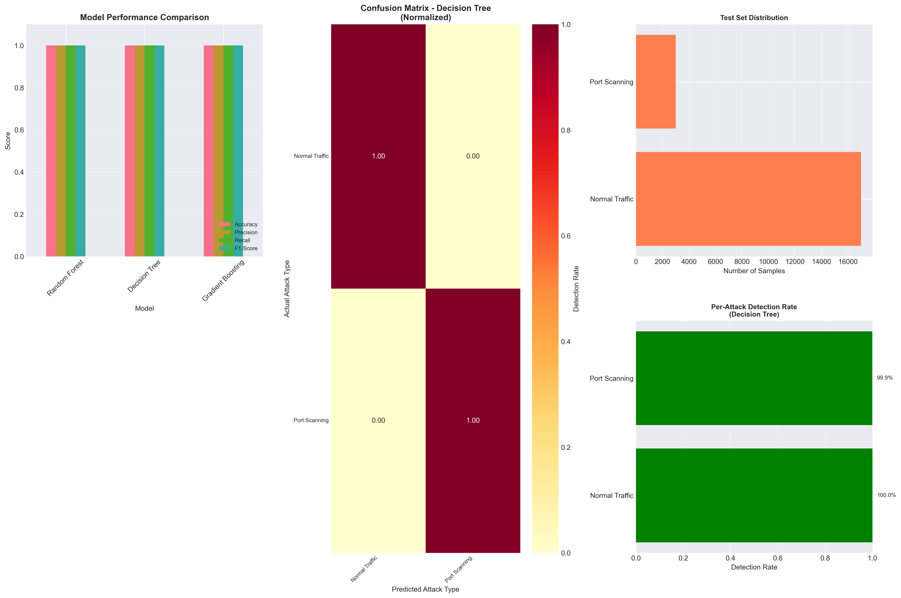

# Network Intrusion Detection System (IDS)

Machine Learning-based Intrusion Detection System trained on the CICIDS2017 dataset to detect various network attacks.

## 🎯 Project Overview

This project implements a multi-class classification system to identify 7 types of network traffic:
- Normal Traffic
- DoS (Denial of Service)
- DDoS (Distributed Denial of Service)
- Port Scanning
- Brute Force attacks
- Web Attacks
- Botnet traffic

## 📊 Dataset

- **Dataset**: CICIDS2017 (Canadian Institute for Cybersecurity)
- **Size**: 2.5+ million network traffic records
- **Features**: 52 network flow features (packet statistics, flow duration, etc.)

## 🛠️ Technologies Used

- **Python 3.x**
- **Libraries**: 
  - pandas, NumPy (Data processing)
  - scikit-learn (Machine Learning)
  - matplotlib, seaborn (Visualization)

## 🤖 Models Implemented

- Random Forest Classifier
- Decision Tree Classifier
- Gradient Boosting Classifier

All models use balanced class weights to handle imbalanced data.

## 📈 Results

- **Accuracy**: [Add your accuracy here]%
- **F1-Score**: [Add your F1-score here]
- **Best Model**: [Add best model name here]



## 🚀 How to Run

1. Clone the repository:
```bash
git clone https://github.com/YOUR_USERNAME/intrusion-detection-system.git
cd intrusion-detection-system
```

2. Install required packages:
```bash
pip install pandas numpy scikit-learn matplotlib seaborn
```

3. Download the CICIDS2017 dataset from [Kaggle](https://www.kaggle.com/)

4. Update the file path in `ids.py`:
```python
filepath = r'path/to/your/cicids2017_cleaned.csv'
```

5. Run the script:
```bash
python ids.py
```

## 📁 Project Structure
```
intrusion-detection-system/
│
├── ids.py                    # Main IDS implementation
├── ids_results.png           # Performance visualizations
├── best_ids_model.pkl        # Trained model (optional)
└── README.md                 # Project documentation
```

## 🎓 Key Features

- Memory-optimized data loading with stratified sampling
- Automated feature preprocessing and scaling
- Handles imbalanced datasets using balanced class weights
- Comprehensive model evaluation and comparison
- Visualization of results and confusion matrices

## 📝 Future Improvements

- [ ] Add deep learning models (Neural Networks)
- [ ] Implement real-time detection
- [ ] Create web interface for model deployment
- [ ] Add feature importance analysis

## 👤 Author

[Muhammad Hashim Nawaz]
- GitHub: [Hashim-69](https://github.com/Hashim-60)
- Instagram:@_hsh1m_

## 📄 License

This project is open source and available under the [MIT License](LICENSE).
